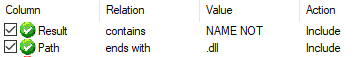
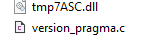
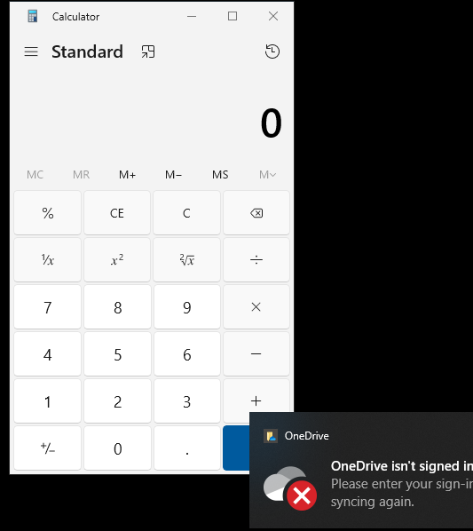

# **DLL Sideloading POC**
Inspired by: https://crypt0ace.github.io/posts/DLL-Sideloading/ 

DLL sideloading is a stealthy exploitation technique that abuses the way Windows searches for and loads Dynamic-Link Libraries (DLLs). This proof of concept (POC) demonstrates how to identify vulnerable applications and execute malicious code while allowing the target program to operate normally.


---

**Identifying Applications Vulnerable to DLL Sideloading**

To find applications susceptible to DLL sideloading, we can use **Process Monitor (Procmon)**, a powerful tool for monitoring system activity. By analyzing DLL loading behavior, we can pinpoint opportunities where Windows fails to locate a DLL, leaving room for exploitation.

**Steps to Set Up Procmon Filters:**

1. Launch Process Monitor.
2. Apply the following filters to focus on DLL loading events:Process Monitor Filters
    - **Process Name**: Set to the target application (e.g., OneDriveStandaloneUpdater.exe).
    - **Operation**: Filter for Load Image to capture DLL loading attempts.
    - **Result**: Filter for NAME NOT FOUND to identify cases where the application searches for a DLL but cannot find it in the expected location.

These failed load attempts indicate that the application does not specify a full path for the DLL, making it vulnerable to sideloading if an attacker can place a malicious DLL in a directory searched by Windows.



---

**What is DLL Sideloading and Why It Works**

**Understanding DLL Sideloading**

DLL sideloading is a variation of DLL hijacking that exploits the **Windows DLL search order**. Unlike traditional hijacking, where a malicious DLL fully replaces the legitimate one, sideloading involves placing *both* a malicious DLL and the legitimate DLL in a directory that Windows prioritizes. The malicious DLL executes attacker-controlled code (e.g., shellcode) and then forwards all other function calls to the legitimate DLL. This dual-DLL approach ensures the application runs as expected, masking the malicious activity.

**Windows DLL Search Order**

When an application loads a DLL without a fully qualified path, Windows searches for it in a specific sequence of directories:

1. **Current Working Directory (CWD)**: The directory from which the application is launched.
2. **System Directory**: Typically C:\Windows\System32.
3. **16-bit System Directory**: Usually C:\Windows\System.
4. **Windows Directory**: Typically C:\Windows.
5. **Application Directory**: The directory containing the executable.
6. **Directories in the PATH Environment Variable**: Any directories listed in the system’s PATH.
7. **Application Data Directory**: Application-specific data locations.

By placing a malicious DLL in a higher-priority directory (e.g., the CWD), an attacker can ensure it is loaded instead of the legitimate DLL located further down the search order. For this POC, we target OneDriveStandaloneUpdater.exe, which does not specify a full path for version.dll.

---

**Proof of Concept Overview**

In this POC, we’ll sideload a malicious version.dll alongside the legitimate one in the CWD of OneDriveStandaloneUpdater.exe. The malicious DLL will execute shellcode to launch calc.exe while forwarding legitimate calls to the renamed original DLL, allowing the updater to function normally.

---

**Preparation**

**1. Generate Shellcode**

We’ll use msfvenom to create shellcode that launches calc.exe as a simple demonstration of code execution.

```bash
msfvenom -p windows/exec CMD=calc.exe -f c -b "\x00" -o shellcode.update
```

- p windows/exec: Specifies the payload to execute a command.
- CMD=calc.exe: Launches the Windows Calculator.
- f c: Outputs the shellcode in C format.
- b "\x00": Avoids null bytes, which could break the exploit.
- o shellcode.update: Saves the output to shellcode.update.

**2. Create the Malicious DLL**

To build the malicious DLL, we’ll use **SharpDLLProxy**, a tool that automates the creation of a proxy DLL capable of executing our shellcode while delegating legitimate functionality.

bash

```bash
.\SharpDllProxy.exe --dll .\version.dll --payload .\shellcode.update
```

This command generates two files:

- **Renamed Legitimate DLL**: A copy of the original version.dll named tmpXXXX.dll
- **C Source File**: A source file for the malicious DLL.

For my POC I renamed the tmp dll to vresion.dll.




**3. Compile the Malicious DLL**

To finalize the malicious DLL:

1. Open **Visual Studio** and create a new **Dynamic-Link Library (DLL)** project in C++.
2. Add the generated version.c file to the project.
3. Make any necessary adjustments (e.g., ensure exported functions match the original DLL’s signature).
4. Compile the project to produce the malicious version.dll.

At this point, you have:

- A malicious version.dll containing the shellcode.
- A renamed legitimate DLL (vresion.dll) to handle forwarded calls.

---

**Execution**

**1. Deploy the DLLs**

- Copy both the malicious version.dll and the renamed legitimate DLL (vresion.dll) into the directory containing OneDriveStandaloneUpdater.exe.

**2. Run the Application**

- Launch OneDriveStandaloneUpdater.exe.
- Observe the results:
    - The updater executes its normal function (e.g., checking for OneDrive updates).
    - The malicious shellcode triggers, opening calc.exe


